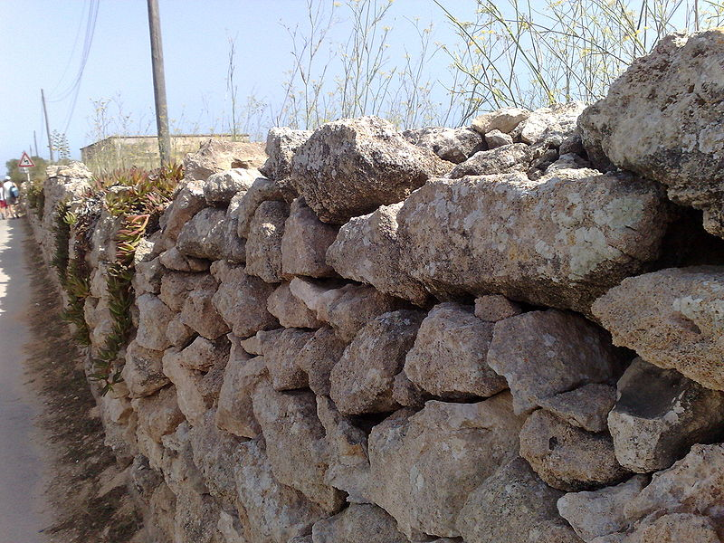

```{r setup, include=FALSE}
options(htmltools.dir.version = FALSE)
knitr::opts_chunk$set(
  fig.width=9, fig.height=3.5, fig.retina=3,
  out.width = "100%",
  cache = FALSE,
  echo = TRUE,
  message = FALSE, 
  warning = FALSE,
  hiline = TRUE
)
```

```{r xaringan-themer, include=FALSE, warning=FALSE}
library(xaringanthemer)
style_duo_accent(
  primary_color = "#1381B0",
  secondary_color = "#FF961C",
  inverse_header_color = "#FFFFFF"
)
```
class: inverse center middle

## How metabolism influences population heterogeneity
---
class: inverse center middle

## Individuals like bricks and population like wall
```{r, echo=FALSE, out.width="60%", fig.cap=""}

```
---
## Individual-Based Model (IBM)
*IBMs* let analyse **population dynamics** through time.

--

The **parameters** of an IBM *shape individual characteristics*

.right-column[
Individual Rates  | Rate Function
----------------  | -------------
Metabolism        | $met_a \cdot M^{met_b}$
Maximal Ingestion | $met_a2.5 \cdot M^{met_b0.75}$
Resource Perception | $met_a 1$
Home Range | $met_a0.75 \cdot M^{met_b0.666}$
Locomotion Cost | $met_a0.5 \cdot M^{met_b0.333}$
Maximal Age | $met_a100 \cdot M^{met_b0.75}$
Reproductive Age | $met_a20 \cdot M^{met_b0.75}$
Reproductive Effort | $met_a0.15 \cdot M^{met_b0.75}$

]
---
## Individual-Based Model Individuals
.left-column[
Individuals characteristics depend on:

- Individual's *Body Size*

- Individual's *Metabolism*
]

.right-column[
$$Ind_{characteristic}=met_a \cdot rate_a \space  M^{met_b \cdot rate_b}$$
]
.pull-right[

]
---
## Individual-Based Model Individuals

## Individual's Size
Individuals grow during iterations. How much they grow depends on *the amount of resources they gather.* 
.pull-right[
```{r, echo=FALSE, out.width="80%", fig.cap=""}

```
]
---


## Individual's Metabolism 
$$Ind_{Met} = met_a \cdot M^{met_b}$$
where $met_b = 0.75$ and $met_a$ = 0.8  or  1.1   or   1.6 .
Different $met_a$ that representes different strategies
--

---
## Individual Based Model Environment
```{r, echo=FALSE, out.width="50%", fig.cap=""}
knitr::include_graphics("IMAGES/MODELEXAMPLE.gif")
```
---
## Individual Based Model Output
$met_{a}$  | Possible Scenarios | Replicates | Iterations
----------------  | ------------- | ------------ | -----------
Low (0.8)        | Homogeneous Population  | 3 | 2000
Mid (1.1) | Combination of two $met_a$: 0.8 & 1.1 / 0.8 & 1.6 / 1.1 & 1.6| 3 | 2000
High (1.6) | Combination of three $met_a$: 0.8 & 1.1 & 1.6| 3 | 2000 |

--

Population Differences in:

- Densities over time

- Individual's distance per iteration

- Individual's energy consumption per iteration

- Individual's reproduction event per iteration

- Individual's energy gain per iteration

---

class: center middle inverse
## Homogeneous Population
---
class: center
## Population Densities
```{r, echo=FALSE, out.width="55%", fig.cap=""}

```
---
class: center middle inverse
## Heterogeneous Population
---
class: center
## Population Densities
```{r, echo=FALSE, out.width="55%", fig.cap=""}

```
---
class: center
## Considered Scenarios
```{r, echo=FALSE, out.width="50%", fig.cap=""}

```
---
class: center
## Low-Mid Scenarios
```{r, echo=FALSE, out.width="47%", fig.cap=""}

```
---
class: center
## Low-High Scenarios
```{r, echo=FALSE, out.width="47%", fig.cap=""}

```
---
## To conclude
The results obtained by the scenarios simulated with this IBM show a *relation between metabolism and population dynamics*. \\
To have better insights about, further implementations that consider an increase in the individuals heterogeneity as well as an increase in the complexity of the environment are well accepted.

Furthermore, the results obtained do not derive directly by real experimental paramtetrization. Indeed, the use of real data to higlight this relations will be valuable
---
